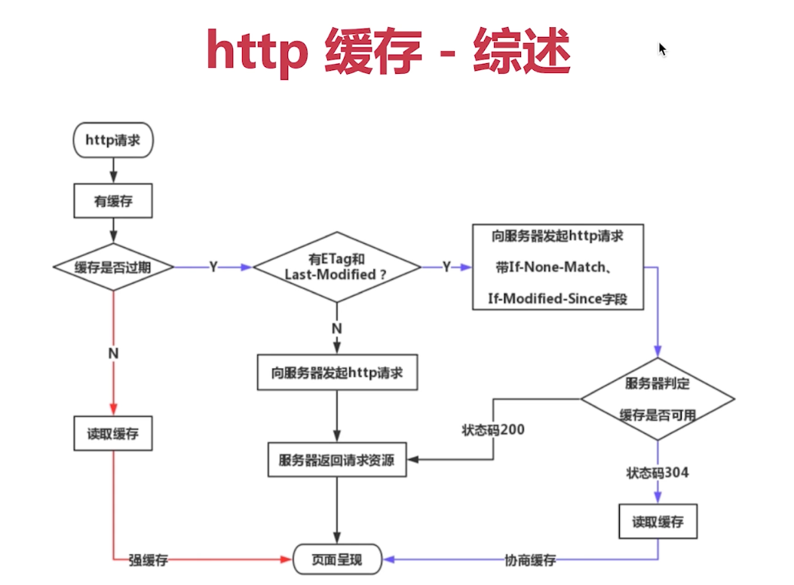

# http

## 状态码种类

1. 1xx 服务端收到请求
2. 2xx 请求成功
3. 3xx 重定向
4. 4xx 客户端错误
5. 5xx 服务端错误

## 常见状态码

1. 200 请求成功
2. 301 永久重定向（配合 Response Headers 内 location，浏览器自动处理，浏览器会记住 location 每次遇到这个网址，都直接重定向到这个 location 中）
3. 302 临时重定向，搜索引擎都是这样
   (配合 Response Headers 内 location，浏览器自动处理，浏览器只会重定向这一次到这个 location 中，下次还是会重新请求老网址)
4. 304 资源未被修改（与缓存机制有关，意思是上一次请求之后，数据没有更改过，本次服务端不会重新返回数据，客户端可以继续使用上一次的缓存）
5. 404 资源未找到
6. **403 没有权限 （登录之类的）**
7. 500 服务器错误 （服务器内的代码报错了）
8. **504 网关超时 （服务器内部互相跳转的时候超时了）**

## http method & restful API

-   传统的 method
    -   get 请求数据
    -   post 向服务器提交数据
-   现代的 method
    -   get 请求数据
    -   post 新建数据
    -   patch/put 更新数据
    -   delete 删除数据
-   restful API
    一种新的 API 设计方法（早已推广使用

    > 传统 API： 把每个 URL 当做一个功能
    > Restful API： 把每个 URL 当做一个 唯一的资源

    **示例：**
    **传统 API 设计：**
    Post /api/create-blog
    Post /api/update-blog?id=100
    Get /api/get-blog?id=100

    **Restful API 设计**
    Post /api/blog
    Patch /api/blog/100
    Get /api/blog/100

    如上，Restful API 通过方法区分功能，URL 对应的都是同一个资源；不像传统 API，每个功能都需要一个独立方法

## http headers

### Request Headers

-   Accept - 浏览器可接收的数据格式
-   Accept-Encoding - 浏览器可接收的压缩算法，如 gzip
-   Accept-Language - 浏览器可接收的语言，如 zh-CN
-   **Connection: keep-alive - 一次性 TCP 连接重复使用, 避免重复**
-   Cookie
-   Host - 请求的域名是什么
-   **User-Agent - 浏览器的信息**
-   Content-Type - 浏览器向服务器发送的数据的数据格式，如 application/json

### Response Headers

-   Content-Type - 返回数据的数据格式，如 application/json
-   **Content-length - 返回数据的大小，多少字节**
-   Content-Encoding - 返回数据的压缩算法，如 gzip
-   **Set-cookie**

### 缓存相关 headers

-   Cache-Control
-   Expires
-   Last-modified
-   If-modifed-since
-   Etag
-   If-none-match

## http 缓存

### 强制缓存

-   cache-control
    在 Response Headers 中
    浏览器根据其值，判断是否需要做强制缓存。
    -   值如下：
        - max-age: 强制缓存，有效期为多少秒
        - no-cache: 浏览器不做强制缓存
        - no-store: 浏览器不做强制缓存，而且也不考虑服务器的缓存策略
    -   工作流程
        1. 初次访问时，浏览器向服务器发送请求
        2. 服务器将数据和 cache-control 同时返回给浏览器
        3. 如果 cache-control 是可以缓存，则将返回的内容设置强制缓存
        4. 在 cache-control 的 max-age 有效期内，浏览器每次需要向服务器请求该数据时
        5. 都直接访问缓存内的数据
        6. 如果发现缓存数据过期，浏览器才会再次向服务器发送请求
           \*\* 现在使用 webpack 打包的话，都会对静态资源加上哈希值，所以每次更新，都会使用户重新向服务器请求静态资源，基本上不会过期。
-   Expires
    同 cache-control 相同，是 cache-control 之前的强缓存方案，现在被替代

### 协商缓存

服务器的缓存策略，在浏览器发送请求的时候，服务器会将一个标识跟随着数据一同返回还给浏览器。之后浏览器在请求的时候都会把该标识发给服务器，服务器将最新的标识与之比对后，告诉浏览器缓存是否可用，如果缓存可用，服务器就会返回 304 状态码。
**Response Headers 返回的标识有以下两个：**

-   Last-modified
    内容上次更新的时间，精确到秒
-   Etag
    一段任意格式的字符串，但是要唯一表示请求内容

**浏览器获得第二次请求开始，都会将上次的标识保存在以下两个 Request Headers 内：**

-   If-modified-since
    与上次 Response Headers 中的 Last-modified 相同
-   If-none-match
    与上次 Response Headers 中的 Etag 相同

**_Etag 和 Last-modified 可以同时存在_**
**_Etag 优先级高于 Last-modified，因为 Etag 是唯一的，更精确_**

### 三种刷新方式对缓存的影响

1. 正常刷新（输入 url、前进后退等）：强制缓存有效、协商缓存有效
2. 手动刷新（F5、右键刷新等）：强制缓存无效、协商缓存有效
3. 强制刷新（Win: ctrl + F5, Mac: shift + command + R）：强制缓存无效、协商缓存无效

### 综述

## https

-   http 是明文传输，容易被中间人劫持
-   https 是 http + 加密，劫持了也没用
-   https 通过 非对称加密和对称加密结合的方式，对传输内容进行加密解密
    对称加密： 一个密钥，双方都用这个密钥进行加密解密
    非对称加密： 一对密钥，一方用密钥 A 加密，另一方用密钥 B 解密，反之也可
-   https 证书
    第三方机构的证书，包含一对非对称加密密钥，给浏览器验证证书合法性，防止中间人攻击偷换公钥

### https 流程

服务器申请了 https 证书之后，自己有一个 证书和证书对应的私钥
证书内包含公钥和证书信息
**证书验证环节**

1. 浏览器向服务器发送请求
2. 服务器将证书发给浏览器
3. 浏览器验证证书合法性
4. 如果证书不合法，弹出 https 警报
5. 如果证书合法，取出证书中的 **公钥 A**

**非对称加密环节**

1. 用 **公钥 A** 加密 **密钥 B**, 并且把 **密钥 B** 发给服务器
2. 服务器收到请求后，用自己的 **私钥 A** 进行解密，获取到 **密钥 B**

**对称加密环节**

1. 服务器用 **密钥 B** 加密数据，发送到浏览器
2. 浏览器用 **密钥 B** 对数据进行解密
3. 之后都是使用 **密钥 B** 对数据进行加密解密
